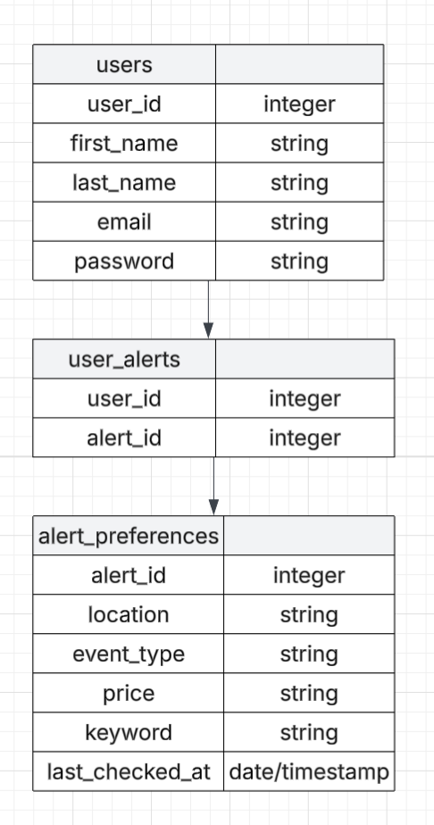

# Springboard-capstone-project

Capstone project for springboard bootcamp.

# Capstone project ideas 💭

## (1) travel planning app

-    upload travel details inlcluding but not limited to:
     -    dates
     -    flights
     -    train tickets
     -    activites
     -    restaurants
-    add people to trips to share iteneraries
-    set up notifications to remind yourself about upcoming itenerary or planning action items
-    AI helper to suggest activities around the area of other events in the itenerary

## (2) recipe/meal planning app

-    upload family recipes (or any recipes) from pdfs/hand written recipes
-    shopping list builder
-    create recipe books to store and categorize recipes
-    base list of recipes from recipe api available
-    share "recipe books" with friends/family

## (3) event recommendation app

-    allows users to set event and location preferences
-    finds and recommends events for users on a set cadence
-    allows users to share events with friends/invite them
-    creates a calendar with events you save/RSVP to

# Capstone project details & proposal -- idea 3: event recommendation app (EventPop)

1. What tech stack will you use for your final project?

-    React Native: For developing a cross-platform mobile application that runs on
     iOS and Android using a single codebase.
-    React: For building the web application, ensuring a consistent and interactive
     user experience across platforms.

2. Is the front-end UI or the back-end going to be the focus of your project? Or are
   you going to make an evenly focused full-stack application?

     - Evenly focused full stack.

3. Will this be a website? A mobile app? Something else?

-    A website and mobile app.

4. What goal will your project be designed to achieve?

-    It will be designed to be an app that people can use to help find and plan fun events/activities.

5. What kind of users will visit your app? In other words, what is the demographic of
   your users?

-    Anyone looking to find events in their area or an area of interest.

6. What data do you plan on using? How are you planning on collecting your data?
   You may have not picked your actual API yet, which is fine, just outline what kind
   of data you would like it to contain. You are welcome to create your own API and
   populate it with data.

-    I plan to use data from ticket master's api.

7. What does your database schema look like?

-    Note that we have not learned about backend/data structures yet so this is a work in progress.
-    

8. What kinds of issues might you run into with your API? This is especially important
   if you are creating your own API, web scraping produces notoriously messy data.

     - Potentially there could be issues accessing the API since I have not used a public API like this before.

9. Is there any sensitive information you need to secure?

-    Yes, user information will need to be secured. Including, but not limited to, passwords and emails.

10. What functionality will your app include?

-    Overarching idea: Keep you up to date on events in your area so you can plan fun outings and activities.
-    Some features/functionality:
     -    allows users to set event and location preferences
     -    finds and recommends events for users on a set cadence
     -    allows users to share events with friends/invite them
     -    creates a calendar with events you save/RSVP to

11. What will the user flow look like?

-    Homepage: Displays home page for user with links to various content pages.
-    Content pages:
     -    Preference page: Users can set up their event notification/filter preferences.
     -    Upcoming events page: Users can see upcoming events based on their set notification preferences and mark events as attending/share them with others.
     -    Calendar page: Users can see events they have marked as attending in a calendar format.
     -    Search/Filter page: Users can search for specific topics and filter content by category and create adhoc filtering.

12. What features make your site more than a CRUD app?

-    The API integration and automated real time event finding aspect make this more than a CRUD app. As well as mulitiple views the user can interact with.

13. What are your stretch goals?

-    Add more than just ticket master to the source data for a more robust set of events.
-    Add notifications for users like when tickets for an event go on sale.
-    For the future, event feed with friends in it/more cross user connection features.
